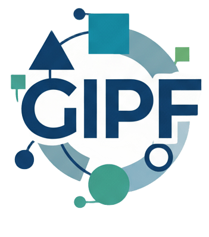

<h1 align="center">FUNIBER — Plataforma Interna de Investigación</h1>

  

---

## Descripción General

La Plataforma Interna de Investigación de FUNIBER es un sistema integral diseñado para coordinar, conectar y optimizar las actividades de investigación dentro de la Fundación Universitaria Iberoamericana. Inspirada en el modelo de LinkedIn, esta herramienta permite a investigadores y docentes administrar sus perfiles, proyectos, convocatorias y compensaciones, mientras que el Departamento de Proyectos mantiene un control centralizado de toda la actividad académica e investigadora.
---

### Modelo del Dominio
Define las entidades principales y sus relaciones dentro del sistema.

[Ver Modelo del Dominio](/documentos/modeloDelDominio/modeloDominio.md)

---

### Casos de Uso
Descripción de las funcionalidades principales del sistema divididas por actor:

- [Actores](/documents/CasosDeUso/Actores/) — Roles y agentes que interactúan con el sistema  
- [Casos de Uso](/documents/CasosDeUso/) — Diagramas y descripciones funcionales  
- [Detallado de Casos de Uso](/documents/CasosDeUso/DetalladoCasosDeUso/) — Flujos, escenarios y reglas de negocio  
- [Diagrama de Contexto](/documents/CasosDeUso/DiagramaDeContexto/) — Sistema en relación con su entorno  
- [Prototipos](/documents/CasosDeUso/Prototipos/) — Interfaces preliminares  
- [Priorización](/documents/CasosDeUso/PriorizaciónCasosDeUso.md) — Orden de implementación recomendado  

---

### Reuniones
Registro de sesiones de requisitado: decisiones, observaciones y cambios en requerimientos.

[Ver Reuniones](/documents/Reuniones/)

---

### Recursos Visuales
Imágenes, diagramas y materiales de apoyo utilizados en la documentación.

[Ver Recursos](/documents/images/)

---

## Estructura del Análisis

El sistema se organiza en cuatro áreas funcionales clave:

| Área | Descripción |
|------|-------------|
| Gestión de Perfiles | Control de información académica, carga laboral y compatibilidad con convocatorias |
| Gestión de Convocatorias | Detección, registro y asignación de oportunidades de financiación |
| Gestión de Proyectos | Seguimiento del ciclo de vida: desde la propuesta hasta la finalización |
| Gestión Financiera | Control de compensaciones, reducciones de carga y registro de gastos |

---

  © 2025 — Ingeniería de Software I · Proyecto FUNIBER — Plataforma GIPF

