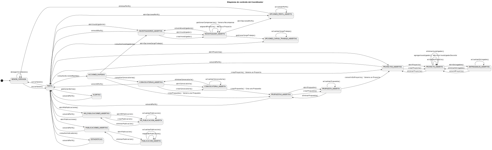
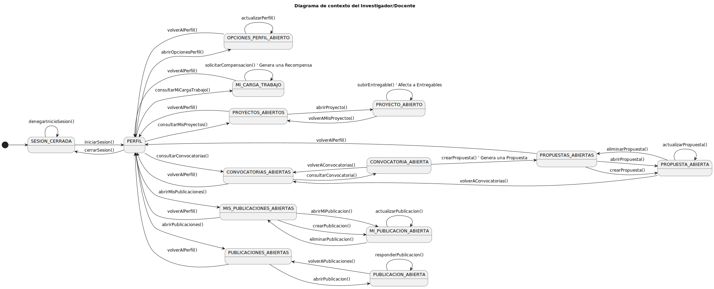

  <h1 align="center">Diagramas de Contexto</h1>

  

  
  
  
  
  
  
  
  
  
  

  

  ---

  

  Visión general de los contextos principales del sistema para los dos roles clave: **Coordinador** y **Investigador/Docente**.

  ---

  ## Diagrama de Contexto – Coordinador

  

    
  

  

    <em>Diagrama que representa las interacciones del Coordinador con el sistema y sus actores externos.</em>
  

  

  
  

  

  ---

  ## Diagrama de Contexto – Investigador / Docente

  

    
  

  

    <em>Diagrama que representa las interacciones del Investigador/Docente con el sistema y sus actores externos.</em>
  

  

  
  

  
